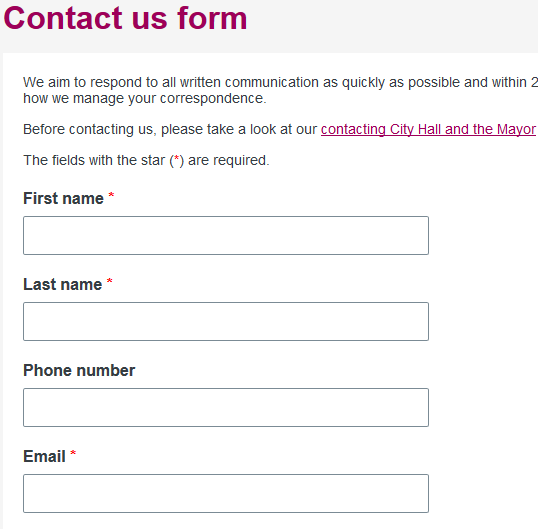

<header>
## Information by color
{: .article-header__title}
</header>

**Impact:** High to major

**Users mainly impacted:** Blind, visually impaired

**RGAA criteria:** [Criterion 3.1 [A]](http://disic.github.io/rgaa_referentiel_en/criteria.html#crit-3-1) - [Criterion 3.2 [A]](http://disic.github.io/rgaa_referentiel_en/criteria.html#crit-3-2)
{: .criteria }

### Explanation

The information given by the color impacts many users. In the first place, blind people who can not see colors, but also users who do not see or distinguish certain colors or color combinations. For all these users, information given only by color will be ignored.

The most common case of information by color is the indication of the active page in the navigation menu. In this case, a simple repair consists in providing the information in text form so that a user who does not perceive the colors (blind or user not perceiving the contrasts) can access the same information. In the case of the active link, we can simply add in the title of the link a reference to the template: "Home - current page".

The principle to keep in mind is that any color conveying information must be accessible by other means, including a textual element.

#### Examples

##### In a form


In this form above, the fields with a red label are required. If you cannot see this color, it is not possible for you to fill in this form correctly.
In this case prefer to add the mention 'required' directly in the label.


##### In a menu


In this menu, the page where we are (iPad) is illustrated by a different color from the other pages. Similarly, if you cannot see this color, you lose this information in the menu.

### Information must not be conveyed through color only

The point here is to verify that the information that is given by a means other than color is consistent. It is important that the information is transmitting by a color, shape and text.

The means of transmitting information other than by colour can be:

* a textual indication
* a means involving graphics (pictogram, background image, shape, different border style, etc.) and through a code complement (aria-label, title, hidden text, aria-current, etc.)
* another typographic style (bold, italic, text size, other font, etc.) and through a code complement (aria-label, title, hidden text, aria-current, etc.)

#### Examples

##### In a form



In this example the required fields are indicated a textual indication (red star). In this case red star is not relevant because this does not imply the requirement to fill in the field. It is necessary to add **before the form** the mention about the required fields like in the example.

The best way to be most relevant is to write the required statement directly on the label. First name (required). This information is purely visual because the field have already a required or aria-required attribute. In order to avoid redundancy of information, it is therefore preferable not to read the required information in the label. Add the attribute aria-hidden to true on this text.

```html
<label for="name">Name <span class="required" aria-hidden="true">(required)</span></label>
<input type="text" id="name" name="name" required>
```

<div class="important">
<svg role="img" aria-label="Important" xmlns="http://www.w3.org/2000/svg" viewBox="0 0 576 512" width="40" height="36"><title>Important</title><path d="M569.517 440.013C587.975 472.007 564.806 512 527.94 512H48.054c-36.937 0-59.999-40.055-41.577-71.987L246.423 23.985c18.467-32.009 64.72-31.951 83.154 0l239.94 416.028zM288 354c-25.405 0-46 20.595-46 46s20.595 46 46 46 46-20.595 46-46-20.595-46-46-46zm-43.673-165.346l7.418 136c.347 6.364 5.609 11.346 11.982 11.346h48.546c6.373 0 11.635-4.982 11.982-11.346l7.418-136c.375-6.874-5.098-12.654-11.982-12.654h-63.383c-6.884 0-12.356 5.78-11.981 12.654z"/></svg>
Added the require attribute on the field is not enough. People who do not use technical assistance do not have the information.
</div>

##### In a Apple menu

###### Currently Apple menu


###### Fixed Apple menu


In this menu we have added a shape (the triangle under the active item) and a code complement (link title attribute).

In this example, to replace the `title` attribute, it also possible to use the [`aria-current`](https://www.w3.org/TR/wai-aria-1.1/#aria-current) attribute to give a state to the element through the code.


