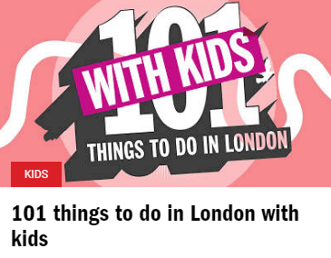

<header>
Decorative image
{: .article-header__title}
</header>

**Impact:** Low to high

**Users mainly impacted:** Blind, severely visually impaired.

**RGAA criteria:** [Criterion 1.2 [A]](http://disic.github.io/rgaa_referentiel_en/criteria.html#crit-1-2)
{: .criteria }

### Explanation

In order to be able to test, you need to know what a decorative image is.

If the image does not contain any information, the image is not intended to be restituted. Its alternative must then be empty. In addition, it must not have a `title` attribute.

<div class="tip">
<svg role="img" aria-label="Tip" xmlns="http://www.w3.org/2000/svg" viewBox="0 0 352 512" width="28" height="40"><title>Tip</title><path d="M96.06 454.35c.01 6.29 1.87 12.45 5.36 17.69l17.09 25.69a31.99 31.99 0 0 0 26.64 14.28h61.71a31.99 31.99 0 0 0 26.64-14.28l17.09-25.69a31.989 31.989 0 0 0 5.36-17.69l.04-38.35H96.01l.05 38.35zM0 176c0 44.37 16.45 84.85 43.56 115.78 16.52 18.85 42.36 58.23 52.21 91.45.04.26.07.52.11.78h160.24c.04-.26.07-.51.11-.78 9.85-33.22 35.69-72.6 52.21-91.45C335.55 260.85 352 220.37 352 176 352 78.61 272.91-.3 175.45 0 73.44.31 0 82.97 0 176zm176-80c-44.11 0-80 35.89-80 80 0 8.84-7.16 16-16 16s-16-7.16-16-16c0-61.76 50.24-112 112-112 8.84 0 16 7.16 16 16s-7.16 16-16 16z"/></svg>
In order to know if an image is decorative or informative, hide it, take into account the context and ask yourself the question:<br>
**Did you lose any information?**<br>
If so, then this image conveys information.
</div>

<div class="important">
<svg role="img" aria-label="Important" xmlns="http://www.w3.org/2000/svg" viewBox="0 0 576 512" width="40" height="36"><title>Important</title><path d="M569.517 440.013C587.975 472.007 564.806 512 527.94 512H48.054c-36.937 0-59.999-40.055-41.577-71.987L246.423 23.985c18.467-32.009 64.72-31.951 83.154 0l239.94 416.028zM288 354c-25.405 0-46 20.595-46 46s20.595 46 46 46 46-20.595 46-46-20.595-46-46-46zm-43.673-165.346l7.418 136c.347 6.364 5.609 11.346 11.982 11.346h48.546c6.373 0 11.635-4.982 11.982-11.346l7.418-136c.375-6.874-5.098-12.654-11.982-12.654h-63.383c-6.884 0-12.356 5.78-11.981 12.654z"/></svg>
Be careful, an image with content text is not always an image that gives information. Look at the example below.
</div>



In this case, when analyzing the context, the image is only a graphical redundancy of the text below. The image is therefore decorative and the alternative should be empty.

### Received ideas

#### Stop abuses for SEO

It is a barrier to accessibility to use the function to fill in an alternative text to the image, or a tooltip, to insert keywords or sentences to improve SEO.

Indeed, a screen reader user will be given all this information. The reading experience will then be overloaded with parasitic elements and will make the site content incomprehensible.

#### An image can have an empty alternative

Not all images require alternative text. If the image is a decoration (it does not provide any essential information to the content), it should not have alternative text. For the same reason as mentioned above, this makes it more difficult for a screen reader user to reproduce content, for no information gain.

### How to integrate a decorative image

#### `img` tag without caption

* It is simply necessary to leave the `alt` attribute empty.
* The decoration image does not have a `title` attribute.

```html

```

#### `svg` tag without caption

* Add `aria-hidden` to `true`.
* The `title` and `desc` tags are absent or empty.
* The `svg` tag or one of its children has no `title` attribute.
* The `svg` tag or one of its children has no `role`, property or ARIA status to label the vector image (e. g. `aria-label`, `aria-describedby`, `aria-labelledby`).

```html
<svg aria-hidden="true" viewBox="0 0 512 512">
    <rect x="64.38" y="149.76" width="159.24" height="27.91"></rect>
</svg>
```

<div class="tip">
<svg role="img" aria-label="Tip" xmlns="http://www.w3.org/2000/svg" viewBox="0 0 352 512" width="28" height="40"><title>Tip</title><path d="M96.06 454.35c.01 6.29 1.87 12.45 5.36 17.69l17.09 25.69a31.99 31.99 0 0 0 26.64 14.28h61.71a31.99 31.99 0 0 0 26.64-14.28l17.09-25.69a31.989 31.989 0 0 0 5.36-17.69l.04-38.35H96.01l.05 38.35zM0 176c0 44.37 16.45 84.85 43.56 115.78 16.52 18.85 42.36 58.23 52.21 91.45.04.26.07.52.11.78h160.24c.04-.26.07-.51.11-.78 9.85-33.22 35.69-72.6 52.21-91.45C335.55 260.85 352 220.37 352 176 352 78.61 272.91-.3 175.45 0 73.44.31 0 82.97 0 176zm176-80c-44.11 0-80 35.89-80 80 0 8.84-7.16 16-16 16s-16-7.16-16-16c0-61.76 50.24-112 112-112 8.84 0 16 7.16 16 16s-7.16 16-16 16z"/></svg>
[How to integrate icons in an accessible way](../../techniques/accessible-icons.html).
</div>
