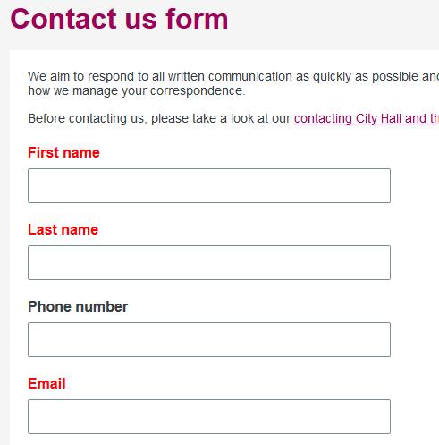

<header>
## Criterion 3.1 [A] On each Web page, [information](../glossary.html#mInfoCouleur) must not  be conveyed through color only. Has this rule been followed?
{: .article-header__title}
</header>

**Impact:** High to major

**Users mainly impacted:** Blind, visually impaired

### Explanation

The information given by the color impacts many users. In the first place, blind people who can not see colors, but also users who do not see or distinguish certain colors or color combinations. For all these users, information given only by color will be ignored.

The most common case of information by color is the indication of the active page in the navigation menu. In this case, a simple repair consists in providing the information in text form so that a user who does not perceive the colors (blind or user not perceiving the contrasts) can access the same information. In the case of the active link, we can simply add in the title of the link a reference to the template: "Home - current page".

The principle to keep in mind is that any color conveying information must be accessible by other means, including a textual element.

### Examples

#### In a form

In this form above, the fields with a red label are required. If you cannot see this color, it is not possible for you to fill in this form correctly.
In this case prefer to add the mention 'required' directly in the label.

#### In a menu

In this menu, the page where we are (iPad) is illustrated by a different color from the other pages. Similarly, if you cannot see this color, you lose this information in the menu.
 

### Mapping with WCAG 2.0

WCAG 2.0 success criteria: [1.4.1](http://www.w3.org/TR/WCAG20/#visual-audio-contrast-without-color) - [1.3.1](http://www.w3.org/TR/WCAG20/#content-structure-separation-programmatic)

WCAG 2.0 sufficient technique(s) and/or failure(s): [G14](http://www.w3.org/TR/WCAG-TECHS/G14.html) - [G182](http://www.w3.org/TR/WCAG-TECHS/G182.html) - [G111](http://www.w3.org/TR/WCAG-TECHS/G111.html) - [G117](http://www.w3.org/TR/WCAG-TECHS/G117.html) - [G138](http://www.w3.org/TR/WCAG-TECHS/G138.html) - [G205](http://www.w3.org/TR/WCAG-TECHS/G205.html)

### Tests

*   **Test 3.1.1:** For each word or for each group of words where color is used to convey [information](../glossary.html#mInfoCouleur), information must not be conveyed through color only. Has this rule been followed?
*   **Test 3.1.2:** For each color indication provided by a text, [information](../glossary.html#mInfoCouleur) must not be conveyed through color only. Has this rule been followed?
*   **Test 3.1.3:** For each image [conveying information](../glossary.html#mInfoDonneeCouleur), [information](../glossary.html#mInfoCouleur) must not be conveyed through color only. Has this rule been followed?
*   **Test 3.1.4:** For each [CSS property defining a color](../glossary.html#mPropCouleur) and conveying [information](../glossary.html#mInfoCouleur), information must not be conveyed through color only. Has this rule been followed?
*   **Test 3.1.5:** For each [time-based media](../glossary.html#mMediaTemp) conveying [information](../glossary.html#mInfoCouleur), information must not be conveyed through color only. Has this rule been followed?
*   **Test 3.1.6:** For each [non-time-based media](../glossary.html#mMediaNoTemp) conveying [information](../glossary.html#mInfoCouleur), information must not be conveyed through color only. Has this rule been followed?

### How to test

#### Tests 3.1.1, 3.1.2, 3.1.3, 3.1.4, 3.1.5, 3.1.6

1.  In the page, spot the pieces of information conveyed by color in a text, an image, a time-based or non-time-based media.
2.  For each of them, check that there is another means to retrieve this information (presence of a `title` attribute, an icon, a size or position-based graphic effect, a typographic effect…).
3.  If true, the test is passed.
