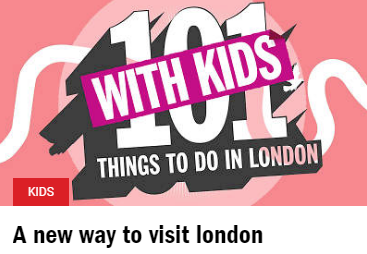

<header>
## Criterion 1.3 [A] For each [image conveying information](../glossary.html#mImgInfo) with a [text alternative](../glossary.html#mAltTexteImg), is this alternative relevant (except in [particular cases](../particular-cases.html#cpCrit1-3 "Particular cases for criterion 1.3"))?
{: .article-header__title}
</header>

**Impact:** Major

**Users mainly impacted:** Blind, severely visually impaired.

### Explanation

In order to be able to test this criterion you need to know what an image conveying information is.

Tip
In order to know if an image is decorative or informative, hide it, take into account the context and ask yourself the question: 
**Did you lose any information?** 
If so, then this image conveys information.
{: .tip}

Important
* Always take into account the context.
* Try to avoid content redundancies.
{: .important}

#### Images that contain text

In this example, the image give an information in text form. In first time, let's check the context.
In this case the context does not give the same content as the image.
If we hide the image, we have lost informations. It is therefore necessary to add an alternative such as "101 things to do in London with kids".

#### Images that represent a scene or action

In this case, if the information is essential to understanding, you must describe it in the alternative text.

Context does not allow us to understand the meaning of images.
On the first image the alternative should be "Push down on the top of the cap to release the contents" and on the second "and mix the ingredients"

Important
It is important to remember that images do not necessarily have to be described in detail. Never extrapolate the meaning of the image. You must provide sufficient and necessary information.
{: .important}

#### Images that represent a graphic

In this case without alternative, it is impossible to distinguish between the telephone number and the fax number.
In any case, if the graphical display of a telephone is used, it is therefore necessary to provide the same information and therefore to provide an alternative.

### Received ideas

#### Do not extrapolate the images

In this example the `alt` of the image is 'Lavender fields in the south of France'.
No information in the image allows us to affirm that we are in the south of France. It is not relevant to specify this.

#### The image alternative must not be used to mention the credits (author, date, etc.) of the image

If you are crediting an image, you should not use the image replacement text. First of all, it means that not everyone has access to this information. Second, the alternative text is used to describe the image, not to assign it.
In the specific case of credits, the use of a legend is the most appropriate, [See criterion 1.10](criterion-1-10.html).
