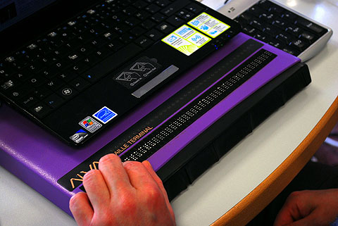

# Visual disability

## Blind persons

### Main difficulties encountered

Blind people will encounter difficulties with:

* all types of **non-text content** (images, information given only by colour, video, etc.);
* the **perception of the structure of the information** and the content proposed to them and to which they have sequential access (tables, lists or identification of the main areas of the page, etc.);
* the use of **interactive elements**: form elements, JavaScript-rich components (tab system, modal window or input calendar) and moving content or dynamic insertion of content into the page.

[Blindness demonstration](https://atalan.fr/agissons/en/cecite.html)

### Assistive technologies

Blind people access the content and features of a website or web application through a **screen reader** that:

* vocalizes the contents and some of their properties,
* offers sophisticated navigation features (specific keyboard shortcuts in particular),
* and supports all interactions with interactive elements.

A screen reader is a complex software to use that requires a learning phase. It can be optimized through parameters designed to increase its efficiency and adapt it to the user's capabilities.

#### Video demonstration of a screen reader

<iframe title="Screen reader demonstration" width="560" height="315" src="https://www.youtube.com/embed/q_ATY9gimOM?cc_load_policy=1" frameborder="0" allow="accelerometer; encrypted-media; gyroscope; picture-in-picture" allowfullscreen></iframe>

In addition to the screen reader, blind braillists can use a Braille terminal to access content and interact with it more quickly.

## Visually impaired persons

The term visually impaired includes a wide range of visual impairments related to many vision disorders.

Without aiming at exhaustiveness, we can distinguish visually impaired people who:

* do not see colours, certain colour combinations or which have difficulties in perceiving contrasts;
* have reduced visual acuity;
* suffer from particular types of visual impairment such as loss of peripheral vision or, conversely, loss of central vision, which cause serious reading or locating difficulties in the page.

### Main difficulties encountered

These people will encounter difficulties with:

* the information given only by color,
* the lack of contrasts,
* the use of imperceptible colours or combinations of colours (e. g. green and red for daltonians with deuteranopes),
* the size of the characters.

[Color blindness demonstration](https://atalan.fr/agissons/en/daltonisme.html), [Visual impairment demonstration](https://atalan.fr/agissons/en/malvoyance.html)

### Assistive technologies

To overcome their difficulties, they can use devices that allow them to:

* to increase the contrasts,
* to choose colour combinations that are perceptible to them,
* adapt the font size (reduce or enlarge) to their needs,
* to enlarge the screen using screen magnifiers, possibly coupled with voice systems or the character enlargement features of their browser.

Sources : [Impacts on users](https://github.com/DISIC/guide-impacts_utilisateurs)
